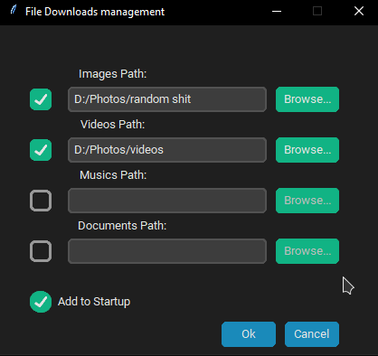

# Downloads management
## About
> This app will automatically organise & move your downloads into folders based on file type.
> This app have a modern gui which you can setup your folders
***

# How to run
* 1st, clone the repository
* 2nd, make sure you have all the dependencies installed (open `install_requirements.bat` to verify)
* 3rd, go into repository and run `python config.py` in console to configure your app 
* 4th, after you saved changes, close the terminal
* Enjoy!
* If you move folder where you installed project, please run `config.py` again to update changes
***

###### ❤️ please follow me on github and star this project ;)
